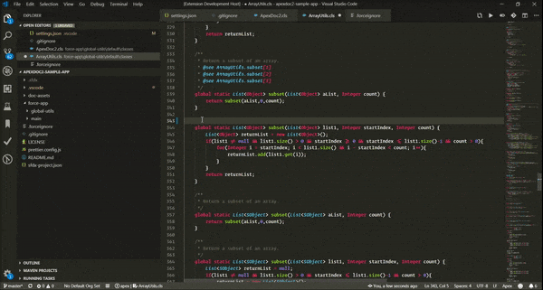

# ApexDoc2 VS Code

ApexDoc2 is A fast, reliable, and configurable documentation generator for Salesforce Apex .cls files, that works with both DX and non-DX projects. ApexDoc2 uses a JSDoc-like inline comment syntax. Simply tell ApexDoc2 where your class files are, and it will generate a set of static HTML pages that fully document each class, including its properties, methods, enums, and annotations.

## Features

- Run ApexDoc2 and immediately launch your docs using the extension's built-in static server.
- Supports documenting .cls files across multiple source directories for DX projects.
- Customizable project "Home page", banner, and Class Group pages.
- Links class, interface, method, prop, and enum signatures to source code hosted on GitHub.
- Customize the favicon, and/or use your own logo, and other static assets in your docs.
- Produces clean, readable HTML output (complements of [pretty](https://github.com/jonschlinkert/pretty)).
- Includes easy-to-use commands and completion items for contextually stubbing ApexDoc2 comment blocks.
- Includes customized syntax highlighting to make your ApexDoc2 comment blocks stand out and easy to read.



## ApexDoc2 Sample Documentation
Check out our ApexDoc2 sample docs to get a feel for what ApexDoc2 documentation looks like: https://apexdoc2-sample-docs.surge.sh. The repository that these docs were created from lives [here](https://github.com/no-stack-dub-sack/apexdoc2-sample-app). If you'd like to easily test out different settings, install the extension and clone the repo; the settings are checked-in in the `.vscode/settings.json` file. Run `ApexDoc2: Run` from the command pallette, and `ApexDoc2: Open Docs` to generate new documentation and preview your changes locally!

## Commands
You can launch the following commands via the command pallette (<kbd>Ctrl/Cmd</kbd> + <kbd>Shift</kbd> + <kbd>P</kbd>):
- **ApexDoc2: Run**: Run ApexDoc2. Many aspects of how this command behaves can be configured using the settings below.
- **ApexDoc2: Open Docs**: Launch a server on localhost and open the generated documentation.
- **ApexDoc2: Stub Comment Block**: On the line above a method, class/interface, property, or enum, invoke this command to stub an ApexDoc2 comment based on the current context. This command can also be invoked by completion item: type `/**` and press <kbd>Tab</kbd> when prompted. The appearance / style of comment stubs can be configured using the settings below.

## Extension Settings

### The ${workspaceFolder} variable
For any setting that refers to a path on your file system, you can use the variable `${workspaceFolder}` to refer to the root folder of your project. If you have a multi-root setup, you can use `${workspaceFolder:directory-name}` to indicate the correct directory.

To avoid confusion, **please note** that this **_is not_** a supported VS Code feature. VS Code does support this and other variables in other settings files, however, in this case, ApexDoc2-VSCode handles the necessary replacements in settings.json to make checking this config into source control and sharing across machines easier.

### Documentation Engine Settings
Use these settings to configure the ApexDoc2 documentation engine.

| Setting | Type | Description | Default |
|---------|------|-------------|---------|
| `apexdoc2.engine.source` | `object[]` |  An array of 'source' objects, each containing the required key `path`, an absolute path of a folder location which contains the Apex .cls files you'd like to document, and optionally a `sourceUrl` key, A URL where the .cls source files are hosted (so ApexDoc2 can provide links to your source code throughout the documentation - confirmed to work with GitHub), e.g.: 'https:\//github.com/no-stack-dub-sack/MyFakeSFProject/tree/master/src/classes'. | If omitted, ApexDoc2-VSCode will default this setting to a single entry with the `path` key defaulting to `${workspaceFolder}/src/classes` for non-DX projects, and `${workspaceFolder}/force-app/main/default/classes` for DX. |
| `apexdoc2.engine.targetDirectory` | `string` |  The Absolute path of the folder location where ApexDoc2 documentation will be generated to.| `${workspaceFolder}/apex-documentation/` |
| `apexdoc2.engine.includes` | `string[]` | A case-sensitive array of file names and/or wildcard patterns that indicate which files in your source directory should be documented. Only simple leading and trailing wildcards are supported. E.g. `[ "NotificationsEmailer.cls", "*TriggerHandler.cls", "Contact*" ]` will result in the file 'NotificationsEmailer.cls' being processed, as well as any files that begin with 'Contact' or end with 'TriggerHandler.cls'. An empty array is treated as 'include all'. | `[]` |
| `apexdoc2.engine.excludes`| `string[]` | A case-sensitive array of file names and/or wildcard patterns that indicate which files in your source directory should NOT be documented. Only simple leading and trailing wildcards are supported. E.g. `[ "NotificationsEmailer.cls", "*TriggerHandler.cls", "Contact*" ]` will result in all files being processed EXCEPT 'NotificationsEmailer.cls' and those begin with 'Contact' or end with 'TriggerHandler.cls'. **Note** that files are excluded before they are included, so keep this in mind when using 'includes' and 'excludes' together. An empty array is treated as 'exclude none'. | `[]` |
| `apexdoc2.engine.homePagePath` | `string` | An absolute path of an HTML file that contains the project's 'home page' markup. Only the markup inside the `<body>` tags will be used, or if the file contains only a partial HTML page, e.g. `<h2>Cool!</h2>`, the entire contents will be used. | |
| `apexdoc2.engine.bannerPagePath` | `string` | An absolute path of an html file that contains the content for the banner section of each generated page.| |
| `apexdoc2.engine.scope` | `string[]` | An array of access modifier scopes to document. | `[ 'global', 'public', 'protected', 'private', 'testMethod', 'webService' ]` |
| `apexdoc2.engine.title` | `string` | The value for the HTML document's &lt;title&gt; attribute. | `Apex Documentation` |
| `apexdoc2.engine.showTOCSnippets` | `boolean` | If set to `false`, ApexDoc2 will hide the method's description snippet in the class's table of contents. | `true` |
| `apexdoc2.engine.sortOrder` | `'logical' \| 'alpha'` | The order in which class methods, properties, and inner classes are presented to the user in your documentation. Either 'logical', the order they appear in the source file, or 'alpha', alphabetically.| `alpha` |
| `apexdoc2.engine.assets` | `string[]` | An array of absolute paths of files you would like to be included in the target directory's 'assets' folder (this is where ApexDoc2 keeps its JavaScript, CSS, and images). For instance, if you'd like to include images in your banner, home page, or class group HTML files, include their path's here, and set the `` tag's `src` attribute to be `./assets/yourImage.png`. If you'd like to override the default favicon, include a file named `favicon.png` in your assets array. | `[]` |
| `apexdoc2.engine.pages` | `string[]` | An array of absolute paths of non-ApexDoc2 generated HTML files that you'd like to be available to your documentation. These files will be placed in your target directory alongside generated HTML files. For example, if you'd like to link to a page from your project's home page or from one of it's class group pages, include that page here. If your file's name is `MyCoolPage.html`, you can then link to it with `href=\"./MyCoolPage.html\"`. | `[]` |
| `apexdoc2.engine.cleanDir` | `boolean` | If set to `true`, ApexDoc2 will run remove any files or folders in your target directory before creating your docs. | `false` |
| `apexdoc2.engine.port` | `number` | The port number that the `ApexDoc2: Open Docs` command will serve your docs on. | `8080` |

### Comment Block Settings
Use these settings to configure the appearance of ApexDoc2 comment block stubs (see the [commands](#commands) section for how to contextually stub a comment block).

| Setting | Type | Description | Default |
|---------|------|-------------|---------|
| `apexdoc2.docBlock.alignItems` | `boolean` | Vertically align anything after an ApexDoc2 @tag. | `false` |
| `apexdoc2.docBlock.omitDescriptionTag` | `boolean` | ApexDoc2 `@description` tags are optional. Set this to `false` to include them in the comment block stub. | `true` |
| `apexdoc2.docBlock.spacious` | `boolean` | When set to `true` ApexDoc2 comment block stubs will add an empty line after the description line and before the next tag. | `false` |

### Minimum Settings Example
This is all that's required to run ApexDoc2. Technically, you could skip this too, and if your project is a standard DX or Salesforce project, the defaults should pick up your source files, but it's better to be explicit.

```jsonc
{
    "apexdoc2.engine.targetDirectory": "C:\\Users\\pweinberg\\Documents\\code\\documentation\\My Salesforce Project",
    "apexdoc2.engine.source": [{
        "path": "C:\\Users\\pweinberg\\Documents\\code\\Salesforce\\src\\classes"
    }]
}
```

### Expanded Settings Example
See our [sample project's settings](https://github.com/no-stack-dub-sack/apexdoc2-sample-app/blob/master/.vscode/settings.json) for a more complex ApexDoc2 configuration.

## Documenting Class Files
ApexDoc2 scans each class file, and looks for comment blocks with special tags (identified by `@` similar to JS and JavaDoc), to find the documentation to include for a given class, interface, enum, method, or property. The comment blocks must always begin with `/**`, end with `*/`, and can cover multiple lines (each subsequent line must begin with `*` or whitespace and then `*`). Here's an example of the most basic ApexDoc2 comment block:

```
/**
 * @description This is the description!
 */
```

### Documentation Tags
Note that in the table below, the 'Class' column includes any top-level types that live within a .cls file, including interfaces and enums. Tags are all optional and are located in the lines above the type's declaration.

| Tag | Description | Class | Method | Enum | Property |
|-------|-------------|-------|--------|------|----------|
| **@description** | A description or overview of the code you are documenting. | :heavy_check_mark: | :heavy_check_mark: | :heavy_check_mark: | :heavy_check_mark: |
| **@group** | The group to display a class under in the menu hierarchy. Un-grouped classes will be placed under 'Miscellaneous'. | :heavy_check_mark: | :x: | :x: | :x: |
| **@group-content** | A relative path (to the project's root directory) to a static HTML file that provides content about the class group. The group's menu item will be hyperlinked to this content, which will be parsed and placed into the documentation's content window. Only one group-content tag is required for all classes in the group. | :heavy_check_mark: | :x: | :x: | :x: |
| **@author** | The author of a class or method. | :heavy_check_mark: | :heavy_check_mark: | :x: | :x: |
| **@since** | The date a class or method was first implemented. | :heavy_check_mark: | :heavy_check_mark: | :x: | :x: |
| **@deprecated** | Indicates class or method should no longer be used; message should indicate replacement path. | :heavy_check_mark: | :heavy_check_mark: | :x: | :x: |
| **@example** | Example code usage. There may only be one `@example` tag per class or method. Start your example on the line below the tag. Code will be given syntax highlighting complements of [highlight.js](https://highlightjs.org/) and be wrapped in `<pre><code>` tags to preserve whitespace. | :heavy_check_mark: | :heavy_check_mark: | :x: | :x: |
| **@param** *param name* | A description of what a method's parameter does. | :x: | :heavy_check_mark: | :x: | :x: |
| **@returns** | A description of a method's return value. | :x: | :heavy_check_mark: | :x: | :x: |
| **@exception** | A description of or list of exceptions that a method throws. | :x: | :heavy_check_mark: | :x: | :x: |
| **@see** | A URL, markdown URL (e.g. '\[ApexDoc2\]\(https://github.com/no-stack-dub-sack/ApexDoc2)', or fully qualified class or method name. The latter creates link(s) to that class or method in the documentation. The name must be a fully qualified name, even if its a reference to another method in the same class, e.g. 'Class.Method', 'Class.InnerClass', 'Class.InnerClass.InnerClassMethod'. For overloaded constructors and methods, the `@see` tag accepts a special syntax: 'MyClass.MyInnerClass.MyOverloadedMethod[3]' where '3' is a zero based index indicating the overloaded method to link to (this would indicate the 4th overload of `MyOverloadedMethod`). When a link cannot be made, a tooltip will be shown on hover. There may be more than one `@see` tag per class / method. | :heavy_check_mark: | :heavy_check_mark: | :x: | :x: |

### Special Tokens
In addition to the `@tag`s listed above, there are a few other special tokens to be aware of:

| Token | Description |
|-------|-------------|
| \` \` | Backticks, \` \`, can be used to indicate inline code within your ApexDoc2 comments. E.g. \`String cool = 'cool!';\` &mdash; the expression within the backticks will be formatted as code. |
| &lt;br&gt; | The &lt;br&gt; tag can be used to render line breaks in your comments when more complex formatting is needed. &lt;br /&gt; is also acceptable. |

### Class Comments (includes class-level Interfaces and Enums)
Located in the lines above any top-level type that lives within a .cls file, or in the lines above inner classes and interfaces.

```apex
/**
* @author P. Weinberg
* @since Mar 2014
*
* @group Core Framework
* @group-content ../../ApexDocContent/Core_Framework.html
* @deprecated Replaced by `JobExtension`
* @see `JobExtension`
* @see `JobPluggable`
*
* @description This class is the base class from which all 'Plugins' will extend. It provides a suite of abstract and
* virtual methods, which implement the `JobPluggable` interface.
* <br><br>
* To ensure flexibility, all methods can be overridden to accommodate a particular plugin's needs.
*/
public abstract class JobPlugin implements JobPluggable {
```

### Property and Inner Enum Comments
These are the simplest comment blocks. They only accept description tags (the tag itself may optionally be omitted for brevity). For properties to be detected by ApexDoc2, they **must** be given an explicit access modifier or have signatures beginning with the `static` keywork. **Other implicitly private properties will not be detected.**

```apex
    /** The countries in which our accounts are located */
    public enum Countries { USA, CANADA, MEXICO, PERU, CHINA, RUSSIA, INDIA }

    /**
    * @description Specifies whether state and country picklists are enabled in this org.
    * Returns true if enabled.
    */
    public static Boolean isStateCountryPicklistsEnabled {
        get {
```

### Method Comments
In order for ApexDoc2 to best identify class methods, the method line must contain an explicit access modifier / scope: global, public, private, testMethod, webService (some implicitly private methods can be detected, but be wary of this. See the note on implicit privacy in the [Tips](#Tips) section below).

```apex
    /**
    * @description A utility method for returning field describe data
    * @param objectName the name of the object to look up
    * @param fieldName the name of the field to look up
    * @returns the describe field result for the given field
    * @exception System.QueryException
    * @see Utils.getSObjectDescribe
    * @see [Some Salesforce Documentation](https://linkToDocs)
    *
    * @example
    * // this is how getFieldDescribe works (the whitespace below will be preserved for complex examples)
    *
    * Schema.DescribeFieldResult result = Utils.getFieldDescribe('Account', 'Name');
    * System.debug(result);
    */
    public static Schema.DescribeFieldResult getFieldDescribe(String objectName, String fieldName) {
```

### Tips
- `@description` tags are optional; you may omit them. ApexDoc2 comments without a tag will be interpreted as the type's description.
- All tags except `@see`, `@group`, and `@group-name` support comments over multiple lines.
- Class and method annotations such as `@IsTest` or `@Future` will be displayed above the class or method's signature, while property annotations such as `@TestVisible` or `@InvocableProperty` will be displayed in the generated properties table.
- **Important note** on implicitly privacy: For ApexDoc2 to best document your class files, it is generally best practice to always give your classes, methods, properties, interfaces, and emums explicit access modifiers. That said, ApexDoc2 does have some ability to detect implicitly private types and methods. For instance, implicitly private `@IsTest` and inner classes, or methods whose signatures start with keywords like `void`, `abstract`, `override` and `virtual`, or with collections or primitive types can still be detected and will be assumed to be private (methods without access modifiers and whose signatures start with custom types or complex built-in types e.g. `Messaging.SendEmailResult[]` will not be detectable). However, in order to not confuse properties with local variables, properties *must* start with access modifiers or the `static` keyword in order to be detected. To best ensure accurate documentation, please always use access modifiers, which can only help to keep your code readable and easily understood!

## Known Issues

ApexDox2 uses some modern HTML5 tags and JavaScript features, so unfortunately Internet Explorer is not supported. If IE supported the HTML5 tags we use (namely `<summary>` and `<details>` for easy, script-less collapsible menus and sections), I would have made an effort to keep the JS supportable by IE, but since IE doesn't support the basic building blocks of the documentation, it made no sense to hold back on the JavaScript, even though there's very little of it.

## Release Notes

Placeholder

### 1.0.0

Initial release of ...